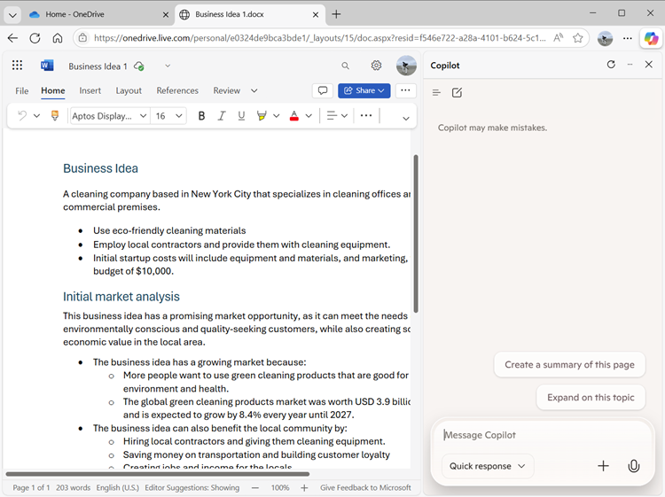
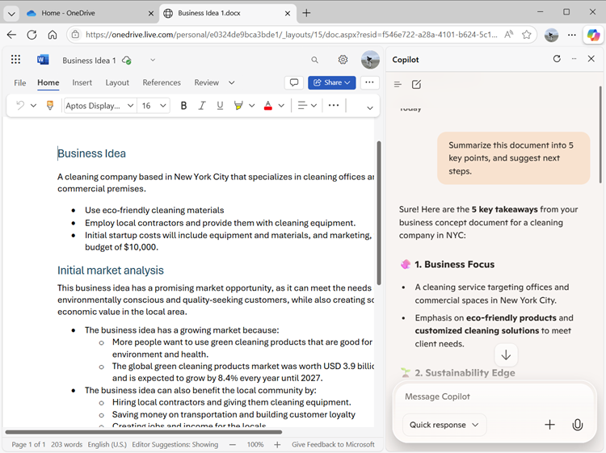
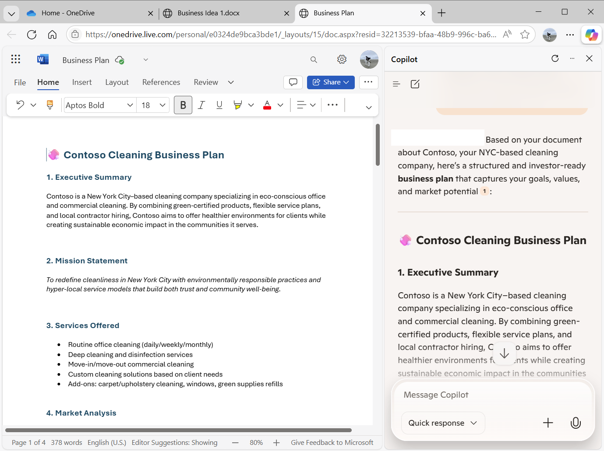
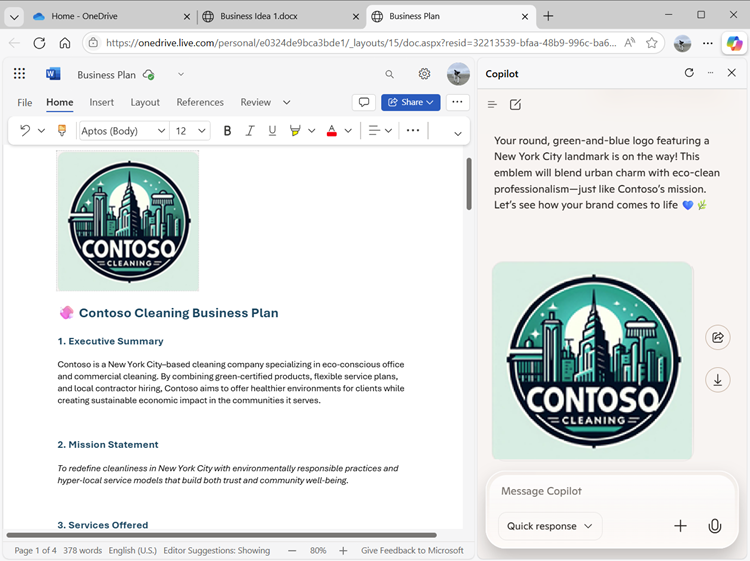
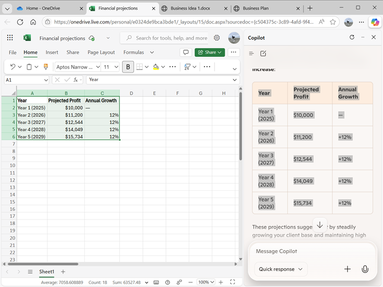
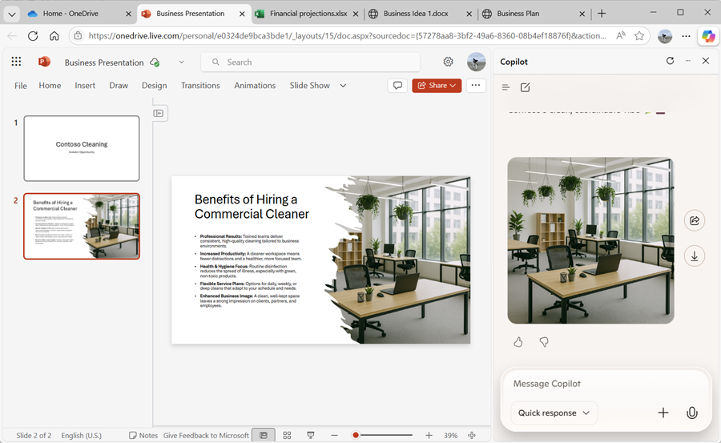
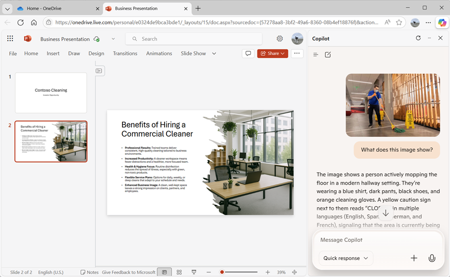
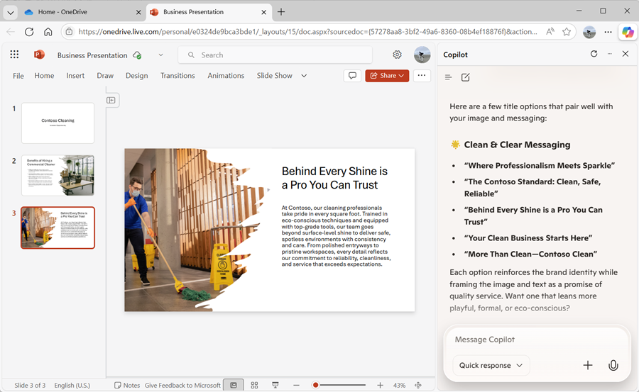
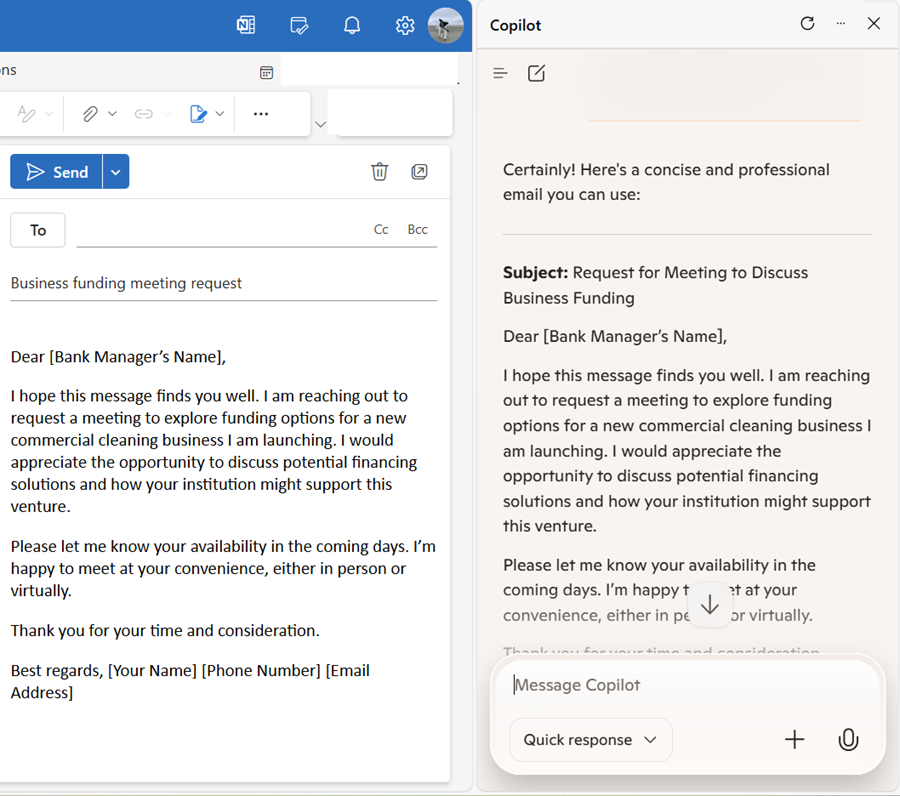

---
lab:
  title: 探索 Microsoft Edge 中的 Copilot
---
# 探索 Microsoft Edge 中的 Microsoft Copilot

欢迎来到 Microsoft Copilot 的精彩世界！

在本练习中，你将利用 Copilot 的强大功能探索一个新的商业理念：创办一家企业清洁公司。

想象一下：你即将推出一项一流的清洁服务，将彻底改变各地的办公空间。 你将借助 Microsoft Copilot 研究市场趋势并制定可靠的业务计划。 但这还没完！ 你还将创建令人信服的文档、引人注目的演示文稿和有说服力的电子邮件，让你的想法落地并吸引投资者。

请准备好在这个引人入胜的交互式实验室中发挥你的创造力和商业才智。 在本练习结束时，你将获得一套全面的带你走上创业成功之路的教材。 让我们开始吧，让你的企业清洁公司成为现实！

完成此练习大约需要 40 分钟。

> **注意**：本练习假设你有一个[个人 Microsoft 帐户](https://signup.live.com)（例如 outlook.com 帐户），你使用该帐户登录到你的计算机上的 [Microsoft Edge](https://www.microsoft.com/edge/download)。 如果你同时拥有工作帐户和个人帐户，请确保在 Microsoft Edge 左上角的帐户设置中选择*个人*帐户。

## 使用 Copilot 来探索文档并研究想法

若要开始探索生成式 AI，让我们使用 Edge 中的 Microsoft Copilot 来检查现有文档并从中提取一些见解。

1. 在 Microsoft Edge 中，浏览到位于 `https://onedrive.live.com` 的 [OneDrive](https://onedrive.live.com) 并使用你的个人 Microsoft 帐户登录 - 关闭显示的任何欢迎消息或产品/服务。
1. 在另一个浏览器标签页中，从 `https://github.com/MicrosoftLearning/mslearn-copilot/raw/main/Allfiles/Business%20Idea.docx` 打开文档 [Business Idea.docx](https://github.com/MicrosoftLearning/mslearn-copilot/raw/main/Allfiles/Business%20Idea.docx)。 然后，在 Edge 中打开文档时，选择“**编辑副本**”选项，将文档复制到 OneDrive。 然后，文档应在 Microsoft Word Online 中自动打开。

    > **提示**：如果未看到编辑副本的选项，请将文档下载到本地计算机。 然后，在 OneDrive 中，使用“**+ 新增**”按钮将 **Business Idea.docx** 文件从本地计算机上传到 OneDrive。

1. 查看 **Business Idea** 文档中的文本，其中描述了有关纽约市清洁业务的一些概要想法。
1. 使用 Edge 工具栏上的 Copilot**** 图标打开 Copilot 窗格，如下所示：

    

1. 在 Copilot 窗格底部的聊天框中，输入以下提示：

    ```prompt
    Summarize this document into 5 key points, and suggest next steps.
    ```

    如果出现提示，请确认是否允许 Copilot 访问页面。

1. 查看 Copilot 的回复，该回复应总结文档中的要点，并提供一些跟进操作建议供你采纳，如下所示：

    

    > **注意**：具体回复可能会有所不同。

    希望 Copilot 提供了一些有用的指导。 但是，如果你有其他问题，可以询问更具体的信息。

1. 输入以下提示：

    ```prompt
    How do I go about setting up a business in New York?
    ```

1. 查看响应，其中应该包含一些建议和资源链接，可帮助你开始在纽约创业。

    > **重要说明**：AI 生成的回复基于网上公开的信息。 虽然它可能有助于你了解创业所需的步骤，但它能不保证 100% 准确，也不能取代对专业建议的需求！

## 使用 Copilot 创建商业计划的内容

现在你已经做了一些初步调查，接下来让 Copilot 帮助你为你的清洁公司制定商业计划。

1. 在 **Business Idea.docx** 文档仍在 Microsoft Edge 中打开的情况下，在 Copilot 窗格中输入以下提示：

    ```prompt
    Suggest a name for my cleaning business.
    ```

1. 查看建议并为你的清洁公司选择一个名称（或继续进行提示以获取更多建议，找到你喜欢的名称）。 选择一个后，让 Copilot 知道是哪一个 - 例如，输入 `Let's go with the first one.`。
1. 确保 **Business Idea** 文档在浏览器主页面中仍处于打开状态，然后输入如下提示：

    ```prompt
    Based on the contents of this document, create a business plan for my cleaning business.
    ```

1. 查看回应。 然后在“Microsoft Word”窗格中的“**文件**”菜单中，创建一个新的空白文档。 如果“**设计器**”窗格打开，则关闭该窗格，并将新文档的名称从*文档*更改为 `Business Plan`。
1. 复制在 Copilot 窗格中生成的业务计划，并将其粘贴到业务计划文档中：

    

1. 在 Copilot 窗格中，输入以下提示：

    ```prompt
    Create a corporate logo for the cleaning company. The logo should be round and include an iconic New York landmark.
    ```

1. 查看 Copilot 生成的图像。

1. 使用更多提示来迭代设计（例如 `Make it green and blue`），直到获得你满意的徽标。

    > **提示**：当 Coplot 生成包含文本的图像时，你可能会注意到一些拼写错误。 尝试不同的提示，直到你对结果满意为止。

1. 右键单击生成的徽标并将其复制到剪贴板。 然后将其粘贴到商业计划文档顶部，如下所示：

    

1. 关闭 Microsoft Word 浏览器选项卡并返回到 OneDrive。

## 使用 Copilot 生成和可视化财务预测

在 Copilot 的帮助下，你已经为清洁业务想法创建了一份商业计划草稿。 现在，让我们使用 Copilot 执行一些计算，以帮助进一步优化业务计划。

1. 在 OneDrive 中，使用“**(+)**”按钮添加新的 ** Excel 工作簿**。 然后将工作簿的名称更改为 `Financial Projections`。
1. 在 Copilot 窗格中，输入以下提示：

    ```prompt
    Create a table of projected profits for the next 5 years, starting with this year. The profit this year should be $10,000 and it should increase by 12% each year.
    ```

1. 查看回复，其中应包括未来五年的预计利润表。
1. 将表复制到剪贴板（注意只选择该表）。 然后在 Excel 工作簿中选择单元格 A1，在“**开始**”选项卡上的“**剪贴板**”菜单中的“**选择性粘贴**”下，选择“**仅值**”，以便将表中的值粘贴到电子表格中，如下所示：

    

1. 在 Copilot 窗格中，输入以下提示：

    ```prompt
    What's a good way to visualize these projections in a chart?
    ```

1. 查看回复，其中应该推荐几种可视化预测数据的方法。 然后输入如下提示：

    ```prompt
    How do I create a line chart in Excel?
    ```

1. 按照 Copilot 提供的指导创建折线图。

    > **提示**：你可能需要调整 Excel 选择的默认数据轴。 选择电子表格中的图表，然后在“**图表**”选项卡上选择“**选择数据**”。 然后在“**图表**”窗格中的“**数据**”选项卡上修改设置，使“**年份**”字段是水平标签，并且仅将“**预计利润**”字段用作折线值：

    

1. 关闭“**图表**”选项卡以查看电子表格中的图表。

1. 关闭 Microsoft Excel 浏览器选项卡并返回到 OneDrive。

## 使用 Copilot 创建演示文稿的内容

你借助 Copilot 为清洁业务制定了一个业务计划，并生成了一些财务预测。 现在，你需要一个有效的演示文稿来说服投资者向你提供创业资金。

1. 在 OneDrive 中，添加一个新的 **PowerPoint 演示文稿**。 如果“设计器”**** 窗格自动打开，请将其关闭。 然后将演示文稿的名称从*演示文稿*更改为 `Business Presentation`。

1. 在演示文稿的标题幻灯片上，输入你的清洁公司的名称作为标题，输入 `Investor Opportunity` 作为副标题。
1. 使用“**两栏内容**”幻灯片版式（其中包括标题和两个内容占位符）插入新幻灯片。
1. 将幻灯片标题更改为 `Benefits of Hiring a Commercial Cleaner`。
1. 在 Copilot 窗格中，输入以下提示：

    ```prompt
    Write a summary of the benefits of using a corporate cleaning company for your business. The summary should consist of five short bullet points.
    ```

1. 将 Copilot 的回复复制到剪贴板，并将其粘贴到左侧内容占位符中。 然后编辑并重格式化占位符中的文本，直到你满意为止。
1. 在 Copilot 窗格中，输入以下提示：

    ```prompt
    Create a photorealistic image of a clean office.
    ```

1. 在 Copilot 生成了你喜欢的图像后，将其复制到剪贴板，并将其粘贴到幻灯片右侧的内容占位符中。

    如果“设计器”**** 窗格自动打开，请选择你喜欢的幻灯片设计。 然后关闭“设计器”**** 窗格。

1. 应用你认为需要的任何其他重格式化操作，直到获得满意的幻灯片：

    

1. 打开新的浏览器选项卡，使用它从 `https://github.com/MicrosoftLearning/mslearn-copilot/raw/main/Allfiles/mopping.png` 下载 [mopping.png](https://github.com/MicrosoftLearning/mslearn-copilot/raw/main/Allfiles/mopping.png) 图像到你的本地计算机，并将其保存在任何文件夹中。
1. 返回到包含 PowerPoint 演示文稿的浏览器标签页，然后在 Copilot 窗格中，使用聊天框旁边的 **+** 按钮将 **mopping.png** 图像上传到 Copilot，并添加提示 `What does this image show?`。
1. 查看回复，应类似于：

    

1. 跟进以下提示，并查看回复：

    ```prompt
    Would this image be helpful to promote a commercial cleaning business?
    ```

    Copilot 分析了图像，并评估了它对你特定业务场景的有用性，就像你征求同事意见一样。

1. 在 PowerPoint 中，添加与之前相同的“**两栏内容**”版式的新幻灯片。 然后在其中一个内容占位符中，上传 **mopping.png** 图像，将其添加到幻灯片。

1. 在 Copilot 窗格中，输入以下提示：

    ```prompt
    Write a short paragraph to accompany this image, emphasizing the professionalism of the cleaning staff we employ.
    ```

1. 查看生成的文本，然后将其复制到幻灯片上的空内容占位符，并根据需要编辑和设置格式。
1. 在 Copilot 窗格中，输入以下提示：

    ```prompt
    Suggest a good title for a slide that contains the image and text.
    ```

1. 使用建议的幻灯片标题，然后使用 PowerPoint 中的设计器设置幻灯片的格式。 最后你会看到一张类似这样的幻灯片：

    

1. 关闭 PowerPoint 浏览器选项卡并返回到 OneDrive。

## 使用 Copilot 安排融资会议

你已经创建了一些辅助材料来帮助你启动业务。 现在是时候联系投资者来寻求一些启动资金了。

1. 使用 OneDrive 标题栏左端的“**应用启动器**”打开 **Outlook**。
1. 切换到“**日历**”页，并将视图更改为“**工作周**”。 如果日历中没有任何计划事件，可以添加一些，以便 Copilot 有一些要处理的信息。
1. 在 Copilot 窗格中，输入以下提示：

    ```prompt
    What events do I have scheduled in this calendar?
    ```
    
    Copilot 应该能够读取网页中的日历并识别日历中的事件：

    

1. 尝试使用此提示检查你是否有时间与银行经理会面，以便为业务融资：

    ```prompt
    What's my availability for a meeting this week?
    ```

    Copilot 应根据 Outlook 网页中的日历信息提供可用性摘要。

    > **注意**：Microsoft Copilot 可以读取在浏览器中打开的日历页面（并可能在当前会话期间“记住”详细信息），但它不能直接访问日历数据。 在企业环境中，组织可以使用 Microsoft 365 Copilot，它*可以*访问 Outlook 中的日历和电子邮件，以及 Microsoft Teams 等其他企业应用中的信息。

1. 切换到“**邮件**”页，创建一个新的电子邮件。 在“**收件人**”框中填入自己的电子邮件地址，并将“**主题**”设置为 `Business funding meeting request`。
1. 在 Copilot 窗格中，输入以下提示：

    ```prompt
    Write an email to a bank manager requesting a meeting to discuss funding for a commercial cleaning business. The email should be concise and the tone should be professional.
    ```
    
1. 使用生成的内容完成电子邮件，如下所示：

    

    如果愿意，你可以向自己发送电子邮件！

## 难题

现在你已经了解了如何使用 Copilot 来研究想法并生成内容，为什么不尝试进一步探索呢？ 若要启动新的 Copilot 会话，请在聊天框旁边的“**+**”菜单中，选择“**开始新聊天**”。 然后，根据在本练习中学到的知识，尝试使用 Copilot 计划一个会议。在这个会议上，你将提议在组织中采用生成式 AI。 下面是一些可帮助入门的建议：

- 研究生成式 AI 和 Microsoft Copilot 对企业的好处，查找有关生产力优势、节省成本的信息以及已经成功采用 AI 的组织示例。
- 创建一个讨论文档，在会议前传阅进行预读。
- 创建一个可用于演示案例的演示文稿，在其中运用数据和可视化效果来强调你演讲中的关键元素。
- 撰写一封电子邮件，向你的同事介绍会议情况并提供一些背景信息。

随心所欲地发挥你的创造力，探索 Copilot 如何通过查找信息、生成并精炼文本、创建图像和回答问题来帮助你。

## 结束语

在本练习中，你使用了 Microsoft Edge 中的 Copilot 来查找信息并生成内容。 希望你已经了解了如何在 Copilot 中使用生成式 AI 来帮助提高工作效率和创造力。

虽然本练习中使用的免费服务无疑非常强大，但你可以通过 [Microsoft 365 Copilot](https://www.microsoft.com/microsoft-365/enterprise/copilot-for-microsoft-365) 等服务实现更多功能，其中 Microsoft Copilot 集成到 Windows 和 Microsoft Office 高效工作应用程序中，为常见任务提供高度情境化的帮助。 Microsoft 365 使你能够将生成式 AI 的强大功能引入到你的业务数据和流程中，同时集成到现有的 IT 基础结构中，以确保实现可管理且安全的解决方案。