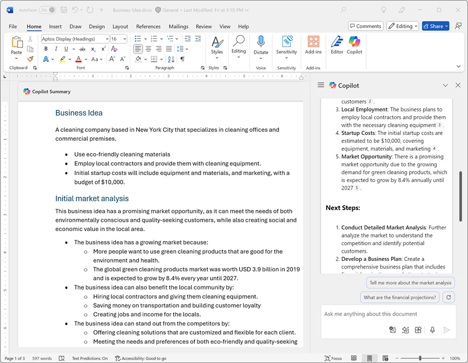
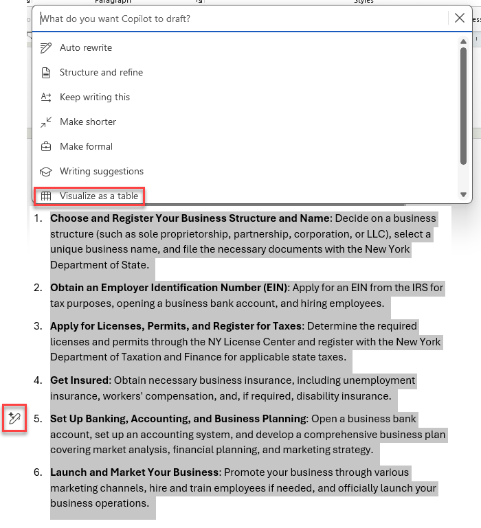
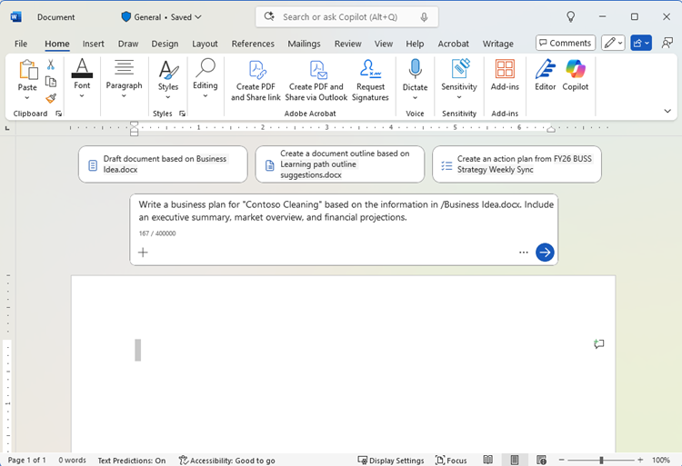
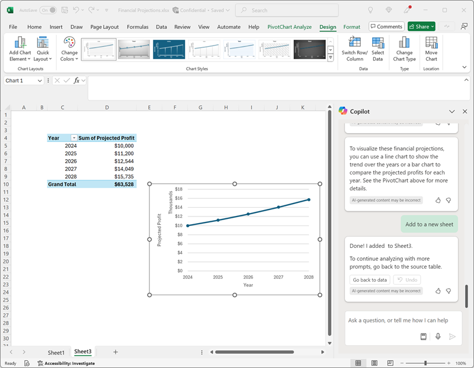
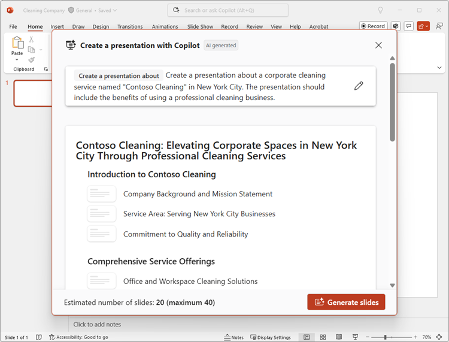
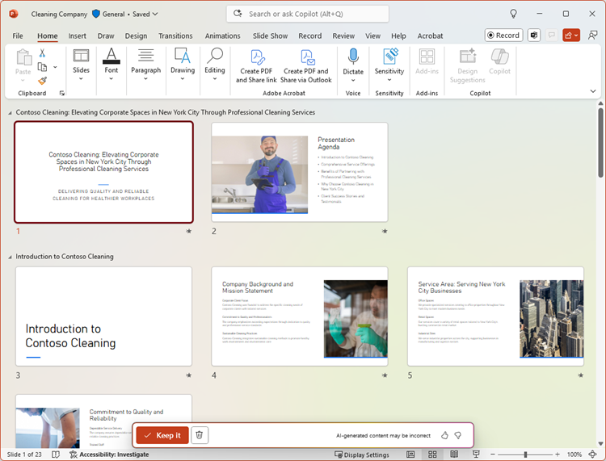
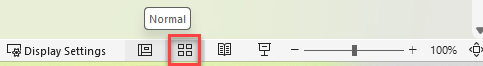
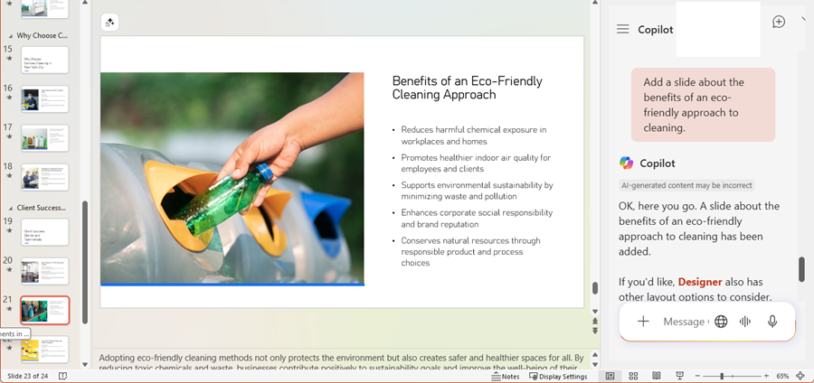
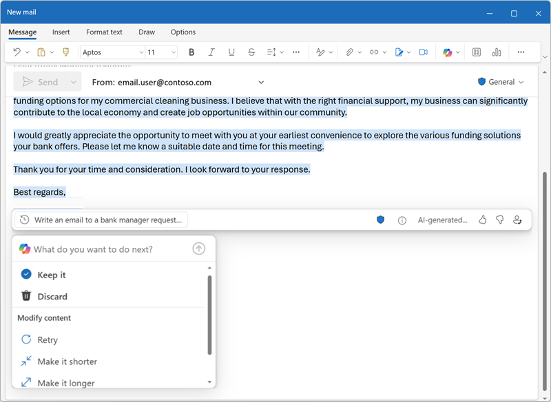

---
lab:
  title: 探索智能 Microsoft 365 Copilot 副驾驶®（网页版）
---
# 探索智能 Microsoft 365 Copilot 副驾驶®（网页版）

欢迎来到使用基于 Web 的 Microsoft 365 应用程序的精彩智能 Microsoft 365 Copilot 副驾驶® 世界！

在本练习中，你将利用 Copilot 的强大功能来探索一个新的商业理念：使用网页版 Microsoft 365 应用程序创办一家企业清洁公司。

想象一下：你即将推出一项一流的清洁服务，将彻底改变各地的办公空间。 你将在 Web 应用程序中借助 Microsoft Copilot 研究市场趋势并制定可靠的业务计划。 但这还没完！ 你还将创建令人信服的文档、引人注目的演示文稿和有说服力的电子邮件，让你的想法落地并吸引投资者。

请准备好在这个引人入胜的交互式实验室中使用 Microsoft 365 网页版发挥你的创造力和商业才智。 在本练习结束时，你将获得一套全面的带你走上创业成功之路的教材。 让我们开始吧，让你的企业清洁公司成为现实！

> **重要说明**：本练习提供了一些提示，你可以利用这些提示在网页版 Microsoft 365 应用中使用 Copilot。 应将这些作为探索 Copilot 的*起点*。 建议修改这些提示，并添加自己的提示，以便与 Copilot 进行迭代对话并优化其生成的结果。 你可能不会完全以练习说明中所述的输出作为结尾，但这没关系 - 关键是要借助 Copilot 进行联系。

完成此练习大约需要 40 分钟。

> **注意**：本练习需要智能 Microsoft 365 Copilot 副驾驶® 许可证，并使用网页版 Microsoft 365 应用程序****。

## Microsoft 365 Web 应用入门

在开始实验练习之前，你需要通过 Web 访问 Microsoft 365。 使用以下主要入口点之一：

- 主门户****：[https://m365.cloud.microsoft/](https://m365.cloud.microsoft/) 或 [https://m365copilot.com](https://m365copilot.com)
- 所有应用****：[https://m365.cloud.microsoft/apps/](https://m365.cloud.microsoft/apps/)

也可以使用以下链接直接访问各个应用程序：
- **OneDrive**：[https://m365.cloud.microsoft/onedrive/](https://m365.cloud.microsoft/onedrive/)
- Word：****[https://word.cloud.microsoft/](https://word.cloud.microsoft/)
- Excel：****[https://excel.cloud.microsoft/](https://excel.cloud.microsoft/)
- PowerPoint：****[https://powerpoint.cloud.microsoft/](https://powerpoint.cloud.microsoft/)
- Outlook：****[https://outlook.office.com/](https://outlook.office.com/)

## 使用 Copilot 来探索文档并研究想法

为了开始探索生成式 AI，我们将使用适用于 Word 网页版的 Copilot 检查现有文档并从中提取一些见解。

1. 在 Web 浏览器中，打开位于 `https://github.com/MicrosoftLearning/mslearn-copilot/raw/main/Allfiles/Business%20Idea.docx` 的文档 [Business Idea.docx](https://github.com/MicrosoftLearning/mslearn-copilot/raw/main/Allfiles/Business%20Idea.docx)。 
1. 将文件下载到“**下载**”文件夹中。
1. 导航到 OneDrive 网页版 ([https://m365.cloud.microsoft/onedrive/](https://m365.cloud.microsoft/onedrive/))，并上传你刚刚下载的 Business Idea.docx 文档********。
1. 从 OneDrive**** 中，通过导航到 [https://word.cloud.microsoft/](https://word.cloud.microsoft/) 或单击 OneDrive 中的文档（关闭任何欢迎消息或新功能通知），在 Microsoft Word**** 中打开 Business Idea.docx****，并查看该文档，其中描述了在纽约市开展清洁业务的一些概要想法。 如果出现提示，请选择顶部的“**启用编辑**”。

    > **提示**：如果“**导航**”窗格处于打开状态，则可以关闭该窗格以查看文档的更多内容。

1. 在 Word 网页版工具栏上查找并选择“Copilot”图标以打开 Copilot 窗格，如下所示（视觉主题可能会有所不同）****：

    

1. 在 Copilot 窗格中，在底部的文本区域中输入以下提示：

    ```prompt
    Summarize this document into 5 key points, and suggest next steps.
    ```

1. 查看 Copilot 的回复，该回复应当汇总文档中的要点，如下所示：

    

    > 收到的特定响应可能因生成式 AI 的性质而异。

    希望 Copilot 提供了一些有用的指导。 但是，如果你有其他问题，可以询问更具体的信息。

1. 返回到 Copilot 窗格，以向 Copilot 提出以下问题：

    ```prompt
    How do I setup a new business in New York? Answer with a numbered list.
    ```

1. 查看响应并根据需要跟进其他问题。 如果对响应内容感到满意，请将其复制到剪贴板。 将其粘贴到 Word 文档中现有文本之后。 然后选择提供了在纽约创业时的待办事项清单的文本，并使用 Copilot 图标（所选文本底部）将文本可视化为表格。

    

1. 查看表格并要求 Copilot 添加更多信息，例如包含更多详细信息的参考列。  响应外观应如下所示（可能需要使用“**重新生成**”按钮）：

    

    > **重要说明**：AI 生成的回复基于网上公开的信息。 虽然它可能有助于你了解创业所需的步骤，但它能不保证 100% 准确，也不能取代对专业建议的需求！

1. 如果对 Copilot 生成的表格感到满意，请选择“**保留**”选项。

## 使用 Copilot 创建商业计划的内容

现在，你已经进行了一些初步研究，可以使用 Microsoft Word 网页版要求 Copilot 帮助你制定清洁公司的商业计划了。

1. 在 Business Idea.docx 文档仍在 Word 网页版中处于打开状态的情况下，在 Copilot 窗格中输入以下提示****：

    ```prompt
    Can you suggest a name for my cleaning business?
    ```

1. 查看建议并为你的清洁公司选择一个名称（或继续进行提示以获取更多建议，找到你喜欢的名称）。
1. 通过导航到 [https://word.cloud.microsoft/](https://word.cloud.microsoft/) 并选择“新建空白文档”**** 来创建一个新的空白文档。 然后，在新文档中，选择边距中的 Copilot 图标以起草新内容。 输入以下提示，并将 **Contoso Cleaning** 替换为你选择的公司名称：

    ```prompt
    Write a business plan for "Contoso Cleaning" based on the information in /Business Idea.docx. Include an executive summary, market overview, and financial projections.
    ```

    

    > **提示**：键入提示，当你键入“/”时，Copilot 应该可以让你浏览 OneDrive 文件夹中的文档。 如果 Copilot 未建议任何文档，可能是因为你的 OneDrive 尚未完全编入索引。 在这种情况下，请将提示修改为 `Write a business plan for "Contoso Cleaning", a commercial cleaning business in New York. Include an executive summary, market overview, and financial projections.`。

1. 生成并查看回复。 保留此回复，调整语气、长度，或要求 Copilot 根据新的提示进行改写。 将适当的标题和样式应用于文档，使其看起来很专业，然后再将其命名为 **Business Plan.docx** 保存到 OneDrive 文件夹中。 你的文档应如下所示：

    

## 在适用于 Excel 的 Copilot 中可视化财务预测

借助商业计划，我们可获取一些有关财务预测的数据，并要求 Excel 网页版中的 Copilot 可视化这些数据，以便我们可以将其包含在电子邮件或面向投资者的演示文稿中。

1. 在 Microsoft Word 网页版中打开商业计划文档后，打开 Copilot 窗格****。
1. 如果生成的商业计划包含预计利润表，请输入以下提示：

    ```prompt
    Create a table of the projected profits in this document.
    ```

    否则输入以下提示：

    ```prompt
    Create a table of projected profits for the next 5 years, starting with this year. The profit this year should be $10,000 and it should increase by 12% each year.
    ```

1. 将预计利润表复制到剪贴板。
1. 通过导航到 [https://excel.cloud.microsoft/](https://excel.cloud.microsoft/) 打开 Excel**** 网页版，并创建一个新的空白工作簿。 立即将工作簿命名为 **Financial Projections.xlsx** 保存到 OneDrive 文件夹中。
1. 将利润预测表粘贴到 Excel 电子表格中，并将其**格式化为表格**。 要执行此操作：
    1. 选择数据中的 **单元格**。
    1. 选择“**开始**”，然后选择“样式”下的“**格式化为表格**”。 
    1. 选择表格的样式。
    1. 在“**创建表格**”对话框中，确认或设置单元格区域。
    1. 标记表是否带有标题，然后选择“**确定**”。
1. 将销售预测格式化为表格后，从 Excel Web 界面的“开始”选项卡打开 Copilot 窗格并输入以下提示****：

    ```prompt
    Suggest ways to visualize these financial projections.
    ```
    
1. Copilot 应建议一种方法来可视化数据，并提议向新工作表添加数据透视图。

    

    > **提示**：如果 Copilot 建议使用不同的数据格式，请输入以下提示 `Visualize the data as a line chart.`。

1. 选择 Copilot 响应中的选项，将数据透视图添加到新工作表并打开它。 选择图表，然后选择“**设计**”以应用样式、更改图表类型和其他操作。 最后，应该具有类似于以下的图表：

    

1. 保存工作簿并关闭 Excel Web 选项卡。

## 使用 Copilot 创建演示文稿的内容

在 Copilot 的帮助下，你已经为清洁业务想法创建了一份商业计划草稿，并制备了一些财务预测表格。 现在，你需要一份有效的演示文稿来使用 PowerPoint 网页版传达业务优势。

1. 通过导航到 [https://powerpoint.cloud.microsoft/](https://powerpoint.cloud.microsoft/) 打开 PowerPoint 网页版****，并创建一个新的空白演示文稿****。 如果“**设计器**”窗格自动打开，请将其关闭。
1. 将演示文稿另存为 OneDrive 文件夹中的 **Cleaning Company.pptx**。
1. 在 PowerPoint Web 界面的“开始”选项卡中选择“Copilot”按钮，选择“创建演示文稿...”，然后在 Copilot 窗格中完成提示，如下所示：************

    ```prompt
    Create a presentation about a corporate cleaning service named "Contoso Cleaning" in New York City. The presentation should include the benefits of using a professional cleaning business.
    ```
1. 查看演示文稿设计，然后选择“生成幻灯片”。****

    
1. Copilot 将在演示文稿中生成幻灯片。  此过程可能需要几分钟时间，输出应如下所示，但主题不同：

    

1. 选择“保留”，然后在 PowerPoint Web 界面的右下角，将“视图”设置为“正常”  ************

1. 选择演示文稿中的倒数第二张幻灯片（如果 Copilot 生成了最后的“*总结*”幻灯片，则为此幻灯片之前的那张）。 然后，在 Copilot 窗格的聊天框中，使用提示 `Add a slide about the benefits of an eco-friendly approach to cleaning.` 提示创建一个新幻灯片

    

1. 保存演示文稿并关闭 PowerPoint Web 选项卡。

## 使用 Copilot 安排融资会议

你已经创建了一些辅助材料来帮助你启动业务。 现在是时候使用 Outlook 网页版联系投资者寻求一些创业资金了。

1. 通过导航到 [https://outlook.office.com/](https://outlook.office.com/) 打开 Outlook 网页版，然后在标题栏上使用 Copilot 图标打开 Copilot 窗格********。
1. 切换到“**日历**”页，并将视图更改为“**工作周**”。 如果日历中没有本周的任何 Scheduled Events，可以添加一些，以便 Copilot 有一些要处理的信息。
1. 在 Copilot 窗格中，输入以下提示：

    ```
    What events do I have scheduled this week?
    ```

    Copilot 应该回应本周 Scheduled Events 的摘要 - 帮助你确定与银行经理会面的时间，以安排启动资金。

1. 切换到“**邮件**”页，创建一封新电子邮件，将你自己的电子邮件地址填写到“**收件人**”框中。
1. 选择“**使用 Copilot 起草**”选项：

    
    
1. 输入以下提示以生成电子邮件草稿：

    ```prompt
    Write an email to a bank manager requesting a meeting to discuss funding for a commercial cleaning business. The email should be concise and the tone should be professional.
    ```

1. 使用 Copilot 优化电子邮件内容，然后选择“**保留**”以完成邮件。

    

1. 如果愿意，你可以向自己发送电子邮件！

## 难题

现在你已经了解了如何在 Web 应用程序中使用智能 Microsoft 365 Copilot 副驾驶® 来研究创意并生成内容，为什么不尝试进一步探索呢？ 

根据在本练习中学到的知识，尝试在网页版 Microsoft 365 应用中使用 Copilot 计划会议，在会议上，你将建议在组织中采用生成式 AI。 下面是一些可帮助入门的建议：

- 研究生成式 AI 和 Microsoft Copilot 对企业的好处，查找有关生产力优势、节省成本的信息以及已经成功采用 AI 的组织示例。
- 使用 Word 网页版创建一个讨论文档，在会议前传阅进行预读。
- 使用 PowerPoint 网页版创建一个可用于演示案例的演示文稿，在其中运用数据和可视化效果来强调你演讲中的关键元素。
- 使用 Outlook 网页版撰写一封电子邮件，向你的同事介绍会议情况并提供一些背景信息。

随心所欲地发挥你的创造力，探索 Copilot 如何通过查找信息、生成并精炼文本、创建图像和回答问题来帮助你 - 所有这些都可以在基于 Web 的 Microsoft 365 环境中完成。

## 结束语

在本练习中，你已在网页版 Microsoft 365 应用程序中使用[智能 Microsoft 365 Copilot 副驾驶®](https://www.microsoft.com/microsoft-365/enterprise/copilot-for-microsoft-365) 查找信息和生成内容。 希望你已经看到，即使完全在 Web 浏览器中工作，在 Copilot 中使用生成式 AI 也能帮助提高生产力和创造力。 Microsoft 365 Web 应用让你能够将生成式 AI 的强大功能引入到业务数据和流程中，同时提供随时随地通过 Internet 访问进行工作的灵活性，从而确保使用可管理、安全、基于云的解决方案。